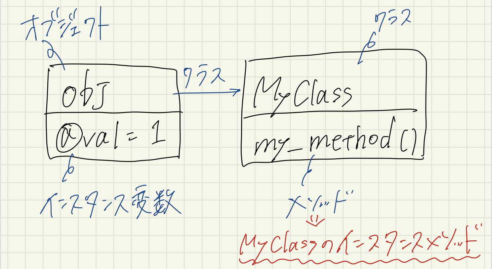
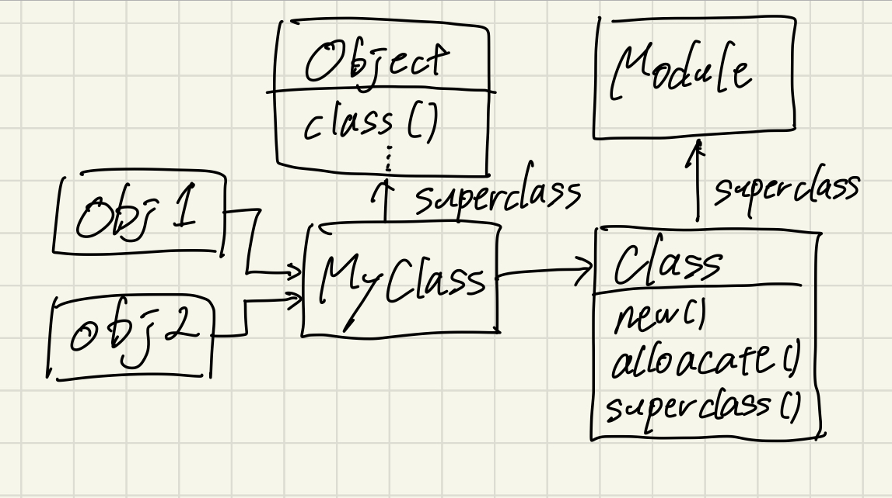

# Object Model

**【目次】**

<aside>
📖 範囲: P.11~28

</aside>

# 2. オブジェクトモデル


## **2-1. オープンクラス**

Rubyではクラスを定義するコードと他のコードに違いがない。

```ruby
# class内

class D
  def x; 'x'; end
end

class D
  def y; 'y'; end
end
```

```ruby
obj = D.new
obj.x
# => "x"
obj.y
# => "y"
```

xメソッドの定義のなかに入ったタイミングでクラスDが定義される。

2回目のclass Dは、既存クラスを再オープンしてyメソッドを追加する。

🌟Rubyのクラスは、クラス宣言よりもスコープ演算子に近い

⇒**オープンクラス**

👿注意: オープンクラスには、標準クラス(String, Array, etc..)も含まれるため、既存のメソッドを上書かないこと。⇒**モンキーパッチ**

## **2–2. オブジェクトモデルの内部**

### **2-2-1.  オブジェクトの中身**

```ruby
class MyClass
  def my_method
    @val = 1
  end
end
```

```ruby
obj = MyClass.new # インスタンス生成
obj.class
# => MyClass

# インスタンス変数
obj.my_method # <= これがないとインスタンス変数「@val」が呼び出せない
obj.instance_variabes
# => [:@val]

# メソッド
obj.methods.grep(/my/)
# => [:my_method]
```



関係性

⇒ MyClassをnewしないと呼び出せないため

### **2-2-2.  クラスの真相**

Rubyのクラスはスーパークラスを継承している。

ex)

```ruby
Array.superclass
# => Object

Object.superclass
# => BasicObject

BasicObject.superclass
# => nil
```

⇒ BasicObjectクラスはRubyのクラス階層のルートであり、基本的なメソッドをいくつか持ったクラス。

ではClassクラスは。。

```ruby
# モジュール
Class.superclass
# => Module
```

🌟すべてのクラスはモジュール

⇒ 正確にはクラスはオブジェクトの生成やクラスを継承するための３つのインスタンスメソッド(new, alloacate, superclass)を追加したモジュール

まとめると。。

```ruby
class MyClass; end

obj1 = MyClass.new
obj2 = MyClass.new
```



クラスの関係図

### **2–2-3.  定数**

大文字で始まる参照は、クラス名, モジュール名含めてすべて**定数**。

```ruby
# 定数のパス

module M
  class C
    X = 'ある定数'
  end

  C::X
  # => "ある定数"
end

M::C::X
# => "ある定数"
```

```ruby
Y = 'ルートレベルの定数'

module M
  Y = 'Mにある定数'

  Y
  # => "Mにある定数"
  ::Y
  # => "ルートレベルの定数"
end
```